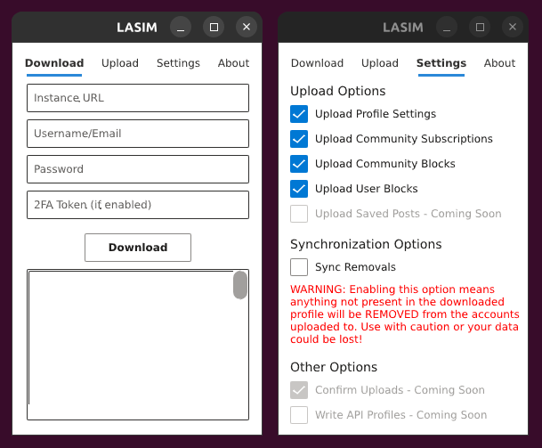

# Lemmy Account Settings Instance Migrator

## How it works

1. Create an account on the server you want to migrate to.
2. Run LASIM, enter your old account credentials, and hit "Download". Your information is saved to a local JSON file.
3. In LASIM, hit the Upload tab, then enter your new account credentials and hit "Upload".
4. The local file is used to update your new account's blocked users, blocked communities, followed communities, and *most* profile settings.
5. **That's it!** Run as many times as you want to keep your accounts in-sync.

## The Settings Tab

There are currently 5 settings you can toggle to alter the default LASIM experience described in *How it works* - they are described in detail below. Note that the state of these settings is written to a settings file in your home directory and restored when LASIM is restarted.

- **Upload Profile Settings** - Whether to take the profile settings of the downloaded profile and apply it to the new profile on upload. These are things like post sort order, NSFW settings, etc.
- **Upload Community Subscriptions** - Whether to add any community subscriptions/follows from the downloaded profile to the new profile on upload.
- **Upload Community Blocks** - Whether to add any community blocks from the downloaded profile to the new profile on upload.
- **Upload User Subscriptions** - Whether to add any user blocks from the downloaded profile to the new profile on upload.
- **Sync Removals** - When enabled, for all *Upload* settings toggled on, also REMOVE any items found in the new profile that are not present in the old profile.
    - Put another way (assuming all *Upload* settings are ticked):
        - *Sync Removals* ON - the account being uploaded to will be altered to always EXACTLY match the downloaded account.
        - *Sync Removals* OFF - the account being uploaded to will always add new follows, new blocks, etc. but will never unfollow or unblock anything
    - Why is *Sync Removals* off by default? Because accidents are worse! Take this example:
        - You make a brand new account. You intend to add all your subscriptions to it, but by accident, you download the new account and upload to the old account. What happens?
            - *Sync Removals* OFF - Basically nothing. At worst, a few of your profile settings (like your default sort) are set back to the Lemmy defaults on your old account.
            - *Sync Removals* ON - **Your entire old account is erased leaving you with two "empty" accounts.**
    - So please *please* **PLEASE** take care when using *Sync Removals*, and always keep a backup of your account in a separate folder!

## Additional Information
- The downloaded profile file is read in when the user clicks *Upload*
    - Therefore do not need to download your profile every time, you can keep a copy and upload as often (or to as many accounts) as you want
- The following profile settings are not modified by LASIM: your avatar image, your banner image, your display name, your email, your bio, your Matrix user, and your 2-Factor token
    - All other profile settings will match your old account
- LASIM is additive by default - it cannot unfollow or unblock anything.
- LASIM has a *Sync Removals* option that makes it NOT additive. Heed the warnings listed in the *Settings Tab* section.
- LASIM will automatically detect if your new account already has some of the blocked users, blocked communities, and/or followed communities and will not re-issue those API calls. This means it is faster on subsequent runs.
- LASIM respects the API rate limits set by your instance owner, so some servers may take longer than others. **Be patient, it has not frozen!**
- LASIM will skip entries that fail to apply - re-run LASIM to try these entries again
- This should go without saying, but obviously both your new and old accounts are still distinct - LASIM simply makes it easier to move from one to the other

## Limitations
- Versions of LASIM only target specific Lemmy BE versions, which are currently changing rapidly. See the Version Support table.
    - Download older versions of LASIM that are compatible with older instances as necessary.
    - You can find your Lemmy BE Version at the bottom of any page of your Lemmy instance.
- Profile Versions refer to the format of the LASIM profile written when you click "Download".
    - As long as the "Profile Version" is the same between LASIM versions, it is possible to use different LASIM versions together to target Lemmy servers running different incompatible API versions.
    - Old versions of your LASIM profile are compatible with newer versions of LASIM, but the reverse is not true.
    - If your version is not explicitely listed, take the latest LASIM that is available!
- Running multiple copies of LASIM *simultaneously* is not suggested since it can clobber the *Settings* in your home directory.

## Version Support
*If your Lemmy BE version is not explicitely listed below, use the latest LASIM available for download.*

| LASIM Version | LASIM Profile Version | Supported Lemmy BE Version(s) |
| ------------- | --------------------- | --------------------------------- |
| 0.1.\*        | 1                     | 0.18.1 (rc.9+), 0.18.2            |
| 0.2.\*        | 2                     | 0.18.3, 0.18.4                    |
